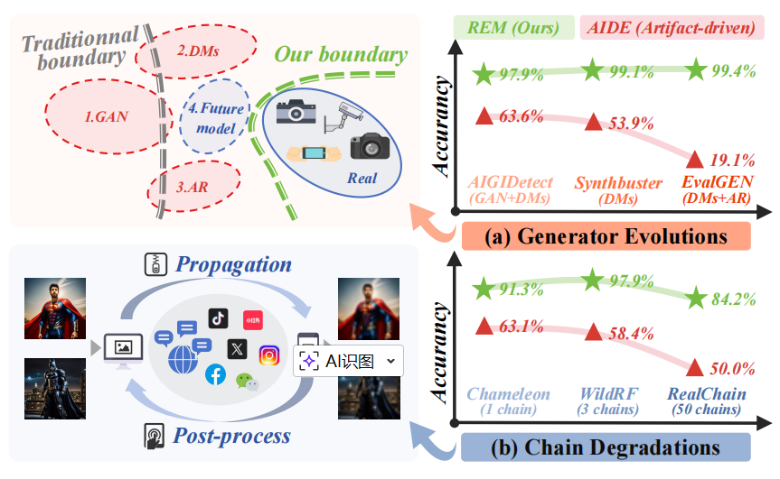
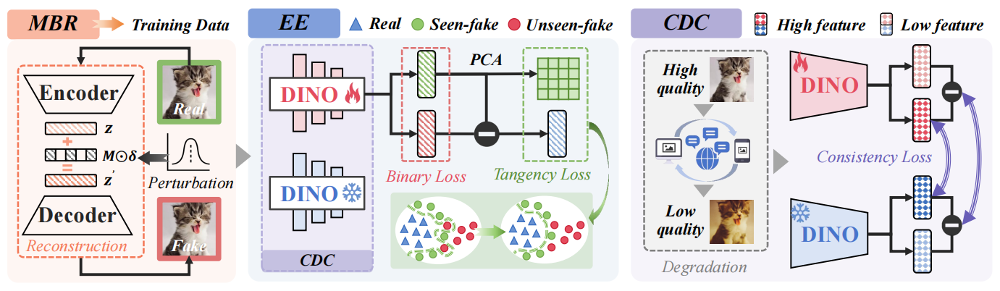
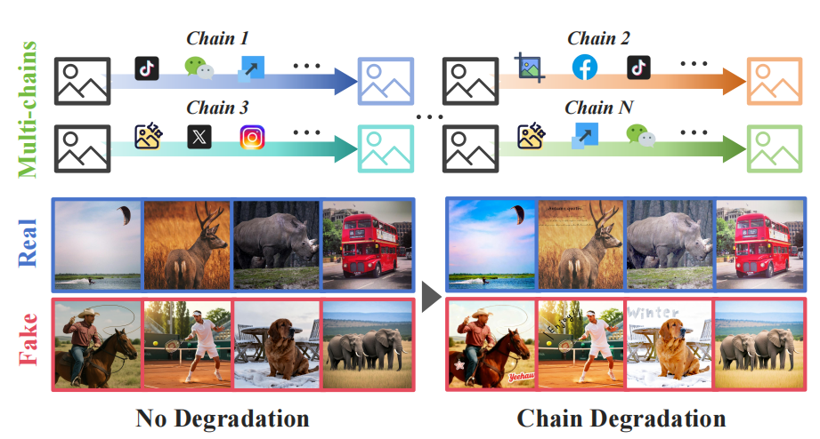
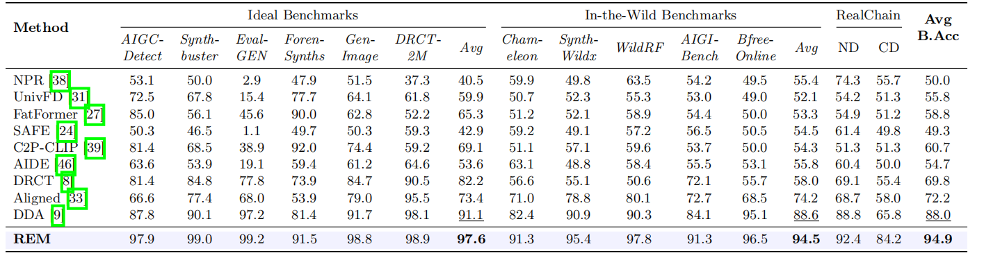

# Beyond Artifacts: Real-Centric Envelope Modeling for Reliable AI-Generated Image Detection

<p align="center">
  <a href="https://arxiv.org/abs/2512.20937"></a>
  <a href="https://huggingface.co/datasets/handsomerich/RealChain"></a>
  <a href="#license"></a>
</p>

## TL;DR

Existing AIGI detectors learn generator-specific **artifacts** that become obsolete as generators evolve and break under real-world degradations. **REM** flips the paradigm: it models the **real image distribution boundary**, achieving robust detection that generalizes to unseen generators and survives chain degradations (social-media compression, filters, stickers, screenshots, ...).

We also release **RealChain**, a comprehensive benchmark with 7 state-of-the-art generators and 50 realistic degradation chains simulating real social media propagation.

<p align="center">
  
</p>

## Highlights

- **New Paradigm**: Real-centric envelope modeling instead of artifact-driven detection — stable, transferable decision boundaries across quality domains
- **State-of-the-Art**: 94.9% average balanced accuracy across 12 benchmarks, +6.9% over previous SOTA
- **Robustness**: 84.2% on severely degraded RealChain (CD), outperforming existing methods by 18.4%
- **Efficiency**: Only requires real images + a VAE for boundary reconstruction — 10x lower GPU cost than diffusion-based data generation

## Method Overview

<p align="center">
  
</p>

REM consists of three key modules:

| Module | What it does |
|--------|-------------|
| **MBR** (Manifold Boundary Reconstruction) | Injects controlled perturbations in VAE latent space to generate diverse near-real samples around the real manifold |
| **EE** (Envelope Estimator) | Learns a compact, smooth boundary via binary classification + tangency regularization |
| **CDC** (Cross-Domain Consistency) | Uses frozen DINO as anchor to keep the envelope stable across different quality domains |

## RealChain Benchmark

**RealChain** is a comprehensive AIGI detection benchmark designed for realistic evaluation under real-world conditions.

### Source Images

| Category | Sources | Count |
|----------|---------|-------|
| **Real** | MSCOCO, OpenImage-v7, Unsplash, ImageNet | 7,000 |
| **Flux.1** (Open-source) | Text-to-Image | 1,000 |
| **SDv3.5** (Open-source) | Text-to-Image | 1,000 |
| **QwenImage** (Open-source) | Text-to-Image | 1,000 |
| **Hunyuan 3.0** (Commercial) | Text-to-Image | 1,000 |
| **NanoBanana** (Commercial) | Text-to-Image | 1,000 |
| **Seedream 4.0** (Commercial) | Text-to-Image | 1,000 |
| **Seedream 4.0 i2i** (Commercial) | Image-to-Image | 1,000 |

### Chain Degradations

Each image undergoes a randomly constructed degradation chain (length 2-5) simulating real social media propagation:

**Propagation** (cross-platform upload/download):
`WeChat` | `TikTok` | `Baidu` | `Instagram` | `X (Twitter)`

**Post-processing** (user editing):
`Filter` | `Sticker` | `Crop/Resize` | `Screenshot`

50 unique degradation chains are applied to both real and synthetic images, producing **No Degradation (ND)** and **Chain Degradation (CD)** versions.

### Download

```bash
# Via Hugging Face
git lfs install
git clone https://huggingface.co/datasets/handsomerich/RealChain
```

### Dataset Structure

```
RealChain/
├── Real/              # 7,000 real images
├── Flux1/             # 1,000 Flux.1 generated
├── SDv3.5/            # 1,000 SD v3.5 generated
├── QwenImage/         # 1,000 QwenImage generated
├── Hunyuan3/          # 1,000 Hunyuan 3.0 generated
├── NanoBanana/        # 1,000 NanoBanana generated
├── Seedream4/         # 1,000 Seedream 4.0 (t2i)
├── i2i/               # 1,000 Seedream 4.0 (i2i)
└── degradation_chains.json  # 50 chain definitions
```

### Visual Samples

<p align="center">
  
</p>

Each column shows original (ND) and degraded (CD) versions across all generators and real images. Chain degradations introduce JPEG artifacts, resolution loss, stickers, and color shifts — faithfully reproducing real social media environments.

## Main Results

<p align="center">
  
</p>

## News

- **[2026/03]** RealChain dataset is now open-sourced on [HuggingFace](https://huggingface.co/datasets/handsomerich/RealChain)!
- Training and inference code will be released soon. Stay tuned!

## Citation

```bibtex
@article{liu2025beyond,
  title={Beyond Artifacts: Real-Centric Envelope Modeling for Reliable AI-Generated Image Detection},
  author={Liu, Ruiqi and Han, Yi and Zhang, Zhengbo and Yao, Liwei and Yan, Zhiyuan and Shen, Jialiang and Chen, ZhiJin and Sun, Boyi and Weng, Lubin and Dong, Jing and others},
  journal={arXiv preprint arXiv:2512.20937},
  year={2025}
}
```

## License

- **Code**: MIT License
- **RealChain Dataset**: [CC BY-NC 4.0](https://creativecommons.org/licenses/by-nc/4.0/)

## Acknowledgements

The real images in RealChain are sourced from [MSCOCO](https://cocodataset.org), [OpenImage-v7](https://storage.googleapis.com/openimages/web/index.html), [Unsplash](https://unsplash.com), and [ImageNet](https://www.image-net.org). Synthetic images are generated using open-source models ([Flux.1](https://github.com/black-forest-labs/flux), [SDv3.5](https://stability.ai), [QwenImage](https://github.com/QwenLM/Qwen2.5-VL)) and commercial APIs ([Hunyuan 3.0](https://hunyuan.tencent.com), [NanoBanana](https://nanobanana.ai), [Seedream 4.0](https://seedream.ai)).
